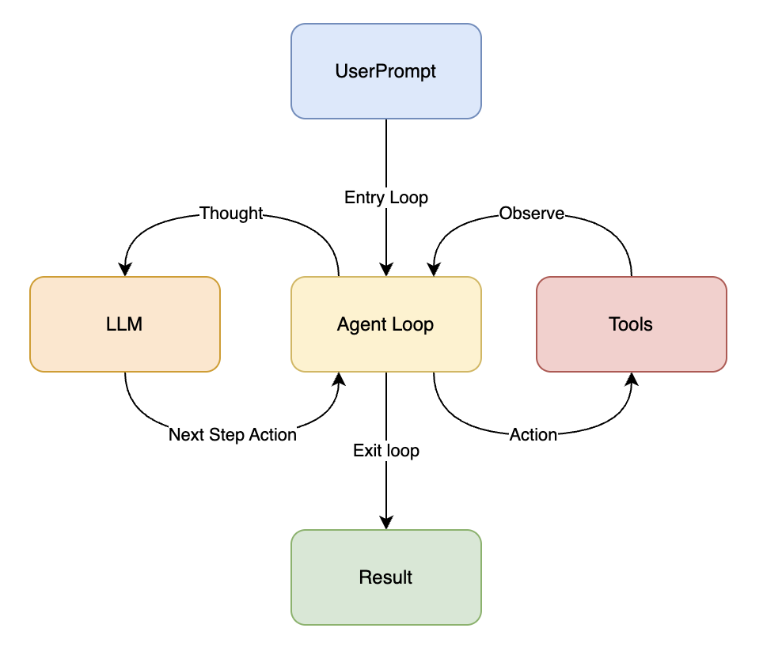

# zcode

`zcode` 是一个通用的 CLI Agent 入门项目。

它想做的事情很简单：参考 `Claude Code` 一类工具的交互方式，但主动砍掉大量工程化细节，只保留最核心的设计思想，用一个更容易读懂、更容易自己动手扩展的最小实现，来探索和学习 `harness` 的搭建过程。

项目灵感来自 [learn-claude-code](https://github.com/shareAI-lab/learn-claude-code)。如果你也对 Agent、工具调用、上下文拼装和模型驱动的执行循环感兴趣，这个仓库就是一个合适的起点。

享受搭建 harness 的过程吧。

## 1 环境配置

先安装依赖。一个最简单的本地启动方式是：

```bash
python3 -m venv .venv
source .venv/bin/activate.fish
pip install -r requirements.txt
```

这里的 `requirements.txt` 会安装当前项目本身，也就是等价于执行：

```bash
pip install -e .
```

目前 `.env.example` 里预留了最基本的模型接入参数：

```env
# 使用任何支持 anthropic 协议的端点
# claude、glm、minimax、kimi 均可
ANTHROPIC_BASE_URL=
ANTHROPIC_AUTH_TOKEN=
MODEL_ID=
```

这意味着 `zcode` 的实验方向会偏向：

- 用统一的协议接入不同模型服务
- 把注意力放在 agent harness 本身，而不是绑定某一家平台 SDK

## 2 运行方式

配置好 `.env` 之后，可以直接运行：

```bash
zcode
```

或者：

```bash
python3 -m zcode
```

也可以用一次性 prompt 的方式执行：

```bash
zcode "帮我看看当前目录结构"
```

## 3 渐进式搭建过程

### 3.1 Minimal Agent Loop



最小的核心循环，包括

- 输入 UserPrompt
- Agent 调用 LLM 进行思考
- Agent 决定下一步 Action
- 调用 Tolls 并 Observe 结果或者直接退出循环

### 3.2 Tools Design

TODO
